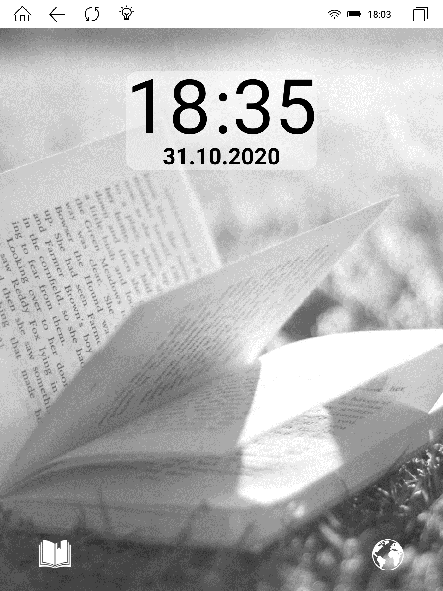
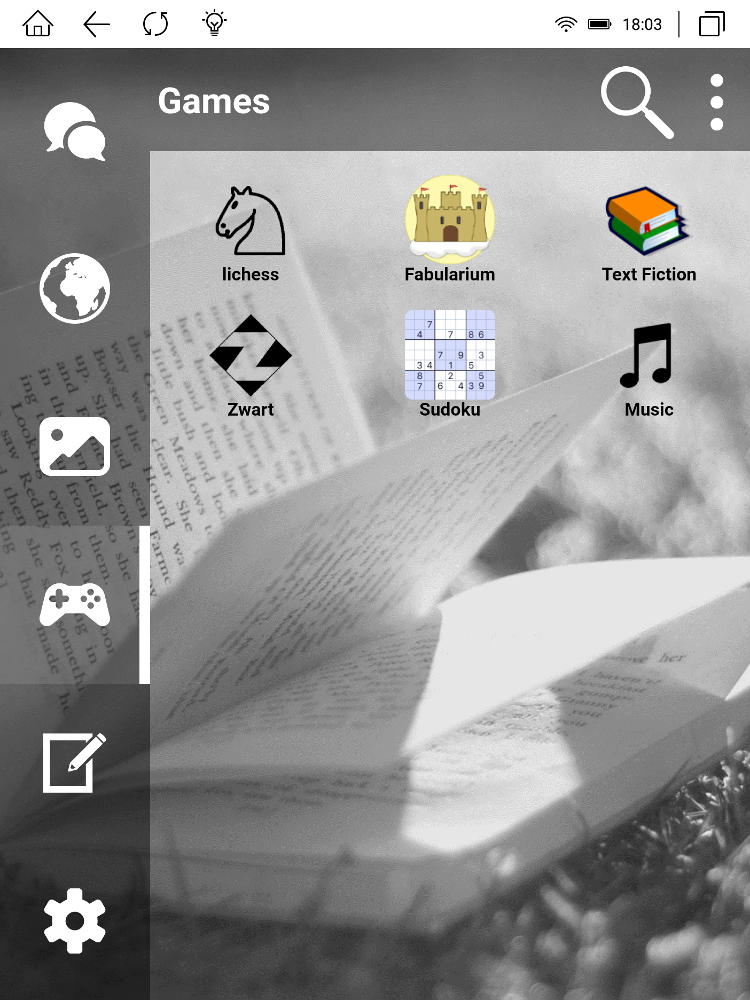
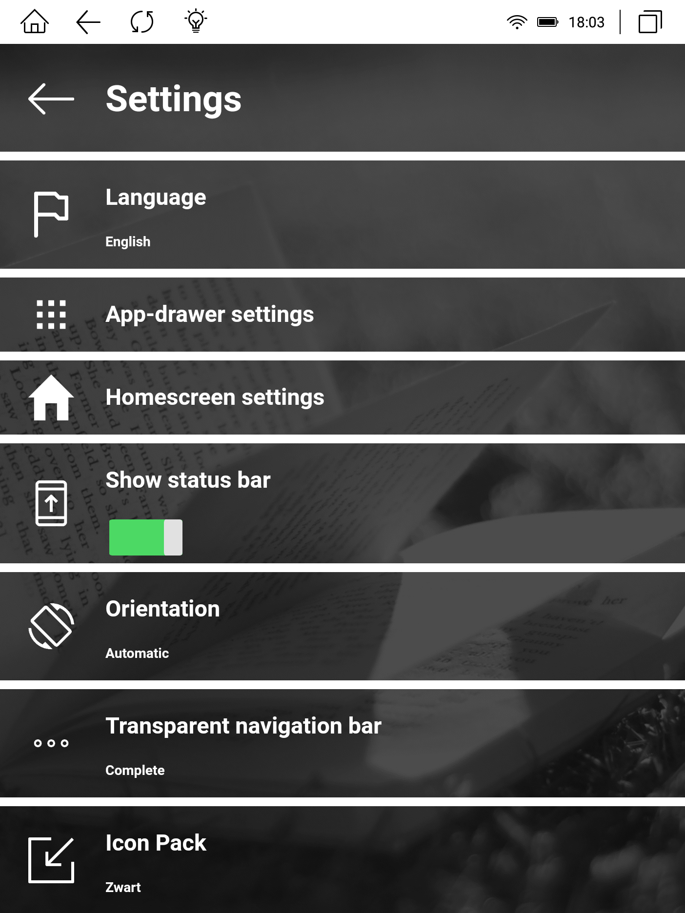

# EinkLukeLauncher

Luke Launcher with changes for eink devices (tested on Likebook Mars).
Original site: https://lukelauncher.de/
Original code: https://gitlab.com/LukeSoftware/lukelauncher

Download: https://github.com/marek-g/EinkLukeLauncher/releases

## Screenshots

## Changes

1. Added static wallpaper (icons/wallpaper.png) as a body background, because Likebook Mars doesn't support Android wallpapers.
2. Adjusted default settings to be more eink friendly.
3. Replaced black & white icon filters with inverted icons.

## FAQ

1. How to change the wallpaper?

Unfortunately, there is no setting for it. The wallpaper is located in APK in path: `assets/www/icons/wallpaper.png`. You can replace it in APK file and sign the result with [APK Editor Studio](https://qwertycube.com/apk-editor-studio/) or [APK Tool](https://ibotpeaches.github.io/Apktool/).

## Build

### Prerequisites

1. Nodejs
2. npm install -g cordova
3. cordova telemetry off
4. JavaSDK 1.8
5. AndroidSDK 28, build-tools 28.0.3
6. gradle 4.1

### Verification

1. cd project_dir
2. cordova requirements

### Build

1. cd project_dir
2. cordova build

Output: platforms\android\app\build\outputs\apk\debug\app-debug.apk
